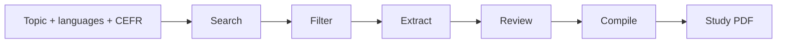
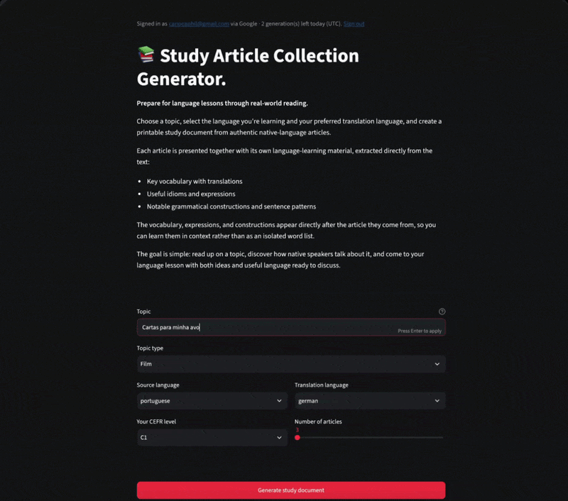

# Study Article Collection Generator

[](https://github.com/cariocaphil/study-article-pipeline/actions/workflows/ci.yml)
[](https://codecov.io/gh/cariocaphil/study-article-pipeline)

Authentic review articles are excellent language input — but finding the right
ones, pulling phrases *above* your level, and turning them into a clean study
pack is tedious and easy to get wrong with a naive LLM wrapper.

This project is a **guarded multi-agent pipeline**: it searches the web for
native-language reviews of a film, book, series, play, or album; extracts
vocabulary and expressions at or above your CEFR level (with translations);
audits phrase quality; and compiles a printable PDF. Typed contracts, client-side
validation tools, trust boundaries, evals, and Azure deployment are first-class
parts of the design — not afterthoughts.

## Highlights

- Five sequenced agents (search → filter → extract → review → compile) with
  Pydantic schemas between stages
- Client-side tool loops that drop unreachable URLs, invented quotes, and lazy
  translations
- Topic + content-type + optional release-year disambiguation (e.g. `Madre (2017)`
  vs *madre!*)
- Offline and live eval suites for faithfulness, classification, recall, and
  translation quality
- Streamlit UI, PDF preview/download, Docker/Podman image, Azure Container Apps
  with Easy Auth (Microsoft + Google), daily quotas, and optional Application
  Insights OpenTelemetry
- CI (Ruff, Pyright, pytest, offline evals, `uv audit`) and CD to ACA on `main`
  (Trivy image scan on deploy)

## Architecture



| Stage | Agent | Responsibility |
|-------|-------|----------------|
| 1 | Search | Find candidate article URLs; preserve topic + content-type + optional year; validate reachability |
| 2 | Filter | Confirm each URL is a genuine review; fetch full text + author (bounded concurrent checks) |
| 3 | Extract | Pull vocab/constructions/idioms at or above CEFR; verify quotes and translations |
| 4 | Review | Independently audit phrases; drop proper nouns, near-duplicates, and low-value items |
| 5 | Compile | Produce the final `.pdf` |

`src/orchestrator.py` sequences the agents and enforces the fallback rule: if
fewer than 3 articles pass filter, the run **stops** instead of padding with
weak matches. Agent contracts and trust boundaries are documented in
[`CLAUDE.md`](CLAUDE.md).

### Validation tools

Agents call **client-side** Python tools in a tool-use loop and keep only items
that pass:

| Tool | Agent | What it checks |
|------|-------|----------------|
| `validate_url_reachable` | Search | SSRF-safe URL (DNS + redirect hops); HTTP HEAD 2xx |
| `verify_quote` | Extract | `sentence_context` is verbatim in the article |
| `validate_translation` | Extract | Translation non-empty and not a lazy copy of the source |

Search and filter also use Anthropic's server-executed `web_search` tool.
Implementations live in `src/tools/`.

## Try it

**Quick start** (local — no live demo link in this repo):

```bash
uv sync                        # installs from committed uv.lock
# create .env with ANTHROPIC_API_KEY=sk-ant-...
uv run pre-commit install   # optional
uv run streamlit run app.py
```

(`uv sync` is fine locally. CI and the container image use `uv sync --frozen`
so installs fail if `uv.lock` is out of date.)

Fill in topic, languages, and CEFR level, then **Generate study document**.
For ambiguous titles, add a year (e.g. `Madre (2017)`). Preview and download the
PDF when the run finishes.



**Sample output:** [Cartas para minha avó — Portuguese → English, B2](docs/samples/Cartas_para_minha_avo_portuguese_english_B2.pdf)
(10-page study pack from a real pipeline run).

CLI:

```bash
uv run python -m src.orchestrator "Entroncamento" portuguese german C1 5
```

Generated files land in `output/` as
`{topic}_{source_language}_{translation_language}_{cefr_level}.pdf`.

## Quality and failure modes

The pipeline is designed to **fail closed** and to be **measurable**:

- **Fail closed:** fewer than 3 filtered articles → no document; quote and
  translation tools drop bad extract items; review removes low-value phrases.
- **Deterministic guards:** offline suites for quote faithfulness, filter
  classification, review actions, extract recall, search URL recall, and
  composite pipeline quality (no API key in CI).
- **LLM-as-judge:** translation adequacy and whole-document quality (structure,
  relevance, usefulness, phrase quality, faithfulness, duplication) for cases
  tools cannot score alone.
- **Concrete regression:** `Madre (2017)` search eval forbids *mother!* /
  `madre!` alternate-work hits so year disambiguation stays honest.

See [Testing](#testing) for suite commands. Agent prompts live in
`src/prompts/`; criteria skills in `.claude/skills/`.

## Further reading

| Topic | Where |
|-------|--------|
| Full setup, CLI args, container, Azure, auth/quotas | Sections below |
| Agent contracts, trust boundaries, eval registration | [`CLAUDE.md`](CLAUDE.md) |
| Quality gates before PRs | [`AGENTS.md`](AGENTS.md) |
| Full PR build history | [`docs/ROADMAP.md`](docs/ROADMAP.md) |

## Requirements

- Python 3.10+
- [uv](https://docs.astral.sh/uv/) for dependency management
- An [Anthropic API key](https://console.anthropic.com/) with access to
  `claude-sonnet-4-6` and credit balance for web search

## Setup

1. Install dependencies (uses the committed `uv.lock` for reproducible installs):

   ```bash
   uv sync
   ```

   After changing dependencies in `pyproject.toml`, run `uv lock` and commit
   the updated `uv.lock`. CI and the container image use `uv sync --frozen`.

2. Create a `.env` file in the project root with your API key:

   ```
   ANTHROPIC_API_KEY=sk-ant-...
   ```

   This file is gitignored — never commit it.

3. Install Git pre-commit hooks (optional but recommended — runs Ruff format and
   check before each commit):

   ```bash
   uv run pre-commit install
   ```

## Usage

### Web app (recommended)

Launch the Streamlit UI:

```bash
uv run streamlit run app.py
```

Fill in the topic, source language, translation language, and your CEFR
level in the browser, then click **Generate study document**. For films,
books, series, theatre productions, or albums with similar titles, add an
optional release or premiere year to the topic (for example, `Madre (2017)`)
to help the search step find the correct work. Preview the PDF in the browser
and download it once the pipeline finishes.

### Command line

Run the orchestrator directly:

```bash
uv run python -m src.orchestrator "<topic>" <source_language> <translation_language> <cefr_level> [n_articles]
```

Example:

```bash
uv run python -m src.orchestrator "Entroncamento" portuguese german C1 5
```

Or, if you're using Claude/Cursor slash commands, use the `/find-articles`
command defined in `.claude/commands/find-articles.md`:

```
/find-articles "<topic>" <source_language> <translation_language> <cefr_level> [n_articles]
/find-articles "Entroncamento" portuguese german C1 5
```

Arguments (CLI and web app):

| Argument | Description | Example |
|----------|-------------|---------|
| `topic` | Film, book, play, album, or subject to search for; optional trailing year disambiguates (web app help text) | `"Madre (2017)"` |
| `topic_type` | Kind of work — combined with topic (and year when present) to disambiguate search (web app dropdown; CLI optional) | `film` |
| `source_language` | Language the review articles are written in | `portuguese` |
| `translation_language` | Language to translate extracted phrases into | `german` |
| `cefr_level` | Your CEFR level — only phrases at or above this level are kept | `C1` |
| `n_articles` | Number of candidate articles to search for (optional, default `5`) | `5` |

`topic_type` values: `film` (default), `series`, `book`, `theatre`, `album`.

## Output

Generated documents are saved to `output/`, named:

```
{topic}_{source_language}_{translation_language}_{cefr_level}.pdf
```

Each document includes, per article: title, author, source, and a table of
extracted phrases with sentence context, translation, category
(vocab/construction/idiom), and estimated CEFR level.

The Streamlit app previews the PDF inline and offers a download button.
CLI runs print the output path when complete.

## Container

Build the image with Podman or Docker:

```bash
podman build -t study-article-pipeline -f Containerfile .
# docker build -t study-article-pipeline -f Containerfile .
```

Run locally on port 8501 (pass your API key at runtime — do not bake it into the image):

```bash
podman run --rm -p 8501:8501 \
  -e ANTHROPIC_API_KEY=sk-ant-... \
  study-article-pipeline
```

Open [http://localhost:8501](http://localhost:8501).

To persist generated PDFs on the host, mount the `output/` directory:

```bash
podman run --rm -p 8501:8501 \
  -e ANTHROPIC_API_KEY=sk-ant-... \
  -v "$(pwd)/output:/app/output" \
  study-article-pipeline
```

The image installs DejaVu Sans so PDF generation works on Linux without bundling font files.

For Azure, build for **linux/amd64** (Container Apps runs AMD64 nodes):

```bash
podman build --platform linux/amd64 -t study-article-pipeline -f Containerfile .
# docker build --platform linux/amd64 -t study-article-pipeline -f Containerfile .
```

## Azure Container Apps

Manual deployment runbook for hosting the Streamlit app on [Azure Container Apps](https://learn.microsoft.com/azure/container-apps/overview) (ACA). Requires the [Azure CLI](https://learn.microsoft.com/cli/azure/install-azure-cli) and an active subscription.

Set names once (adjust region and names as needed):

```bash
RESOURCE_GROUP=study-article-rg
LOCATION=westeurope
ACR_NAME=studyarticleacr          # globally unique, alphanumeric only
ENV_NAME=study-article-env
APP_NAME=study-article-app
IMAGE=study-article-pipeline:latest
```

### 1. Create resource group and Container Registry

```bash
az group create --name "$RESOURCE_GROUP" --location "$LOCATION"

az acr create \
  --resource-group "$RESOURCE_GROUP" \
  --name "$ACR_NAME" \
  --sku Basic \
  --admin-enabled false
```

### 2. Build and push a Linux AMD64 image

From the repo root, build for AMD64 and push to ACR:

```bash
az acr login --name "$ACR_NAME"

podman build --platform linux/amd64 \
  -t "${ACR_NAME}.azurecr.io/${IMAGE}" \
  -f Containerfile .
podman push "${ACR_NAME}.azurecr.io/${IMAGE}"
```

Docker equivalent:

```bash
docker build --platform linux/amd64 \
  -t "${ACR_NAME}.azurecr.io/${IMAGE}" \
  -f Containerfile .
docker push "${ACR_NAME}.azurecr.io/${IMAGE}"
```

### 3. Create Container Apps environment and app

```bash
az containerapp env create \
  --name "$ENV_NAME" \
  --resource-group "$RESOURCE_GROUP" \
  --location "$LOCATION"

az containerapp create \
  --name "$APP_NAME" \
  --resource-group "$RESOURCE_GROUP" \
  --environment "$ENV_NAME" \
  --image "${ACR_NAME}.azurecr.io/${IMAGE}" \
  --target-port 8501 \
  --ingress external \
  --min-replicas 0 \
  --max-replicas 1 \
  --cpu 1.0 \
  --memory 2.0Gi \
  --registry-server "${ACR_NAME}.azurecr.io" \
  --system-assigned \
  --secrets anthropic-api-key=<your-anthropic-api-key> \
  --env-vars ANTHROPIC_API_KEY=secretref:anthropic-api-key
```

Replace `<your-anthropic-api-key>` with your key. Store it as a Container Apps secret — never commit it or bake it into the image.

### 4. Grant managed identity access to ACR

The container app uses a system-assigned managed identity to pull from ACR (admin user stays disabled):

```bash
APP_ID=$(az containerapp show \
  --name "$APP_NAME" \
  --resource-group "$RESOURCE_GROUP" \
  --query identity.principalId -o tsv)

ACR_ID=$(az acr show \
  --name "$ACR_NAME" \
  --resource-group "$RESOURCE_GROUP" \
  --query id -o tsv)

az role assignment create \
  --assignee "$APP_ID" \
  --role AcrPull \
  --scope "$ACR_ID"
```

If the app was created before the role assignment, update it so the revision picks up registry auth:

```bash
az containerapp update \
  --name "$APP_NAME" \
  --resource-group "$RESOURCE_GROUP" \
  --image "${ACR_NAME}.azurecr.io/${IMAGE}"
```

### 5. Verify

Print the public HTTPS URL:

```bash
az containerapp show \
  --name "$APP_NAME" \
  --resource-group "$RESOURCE_GROUP" \
  --query properties.configuration.ingress.fqdn -o tsv
```

Open `https://<fqdn>` in a browser. The app serves Streamlit on port 8501 with external HTTPS ingress terminated by ACA.

Run an end-to-end pipeline test: enter a topic, languages, and CEFR level, then confirm the PDF preview and download work. Check revision logs if anything fails:

```bash
az containerapp logs show \
  --name "$APP_NAME" \
  --resource-group "$RESOURCE_GROUP" \
  --follow
```

### Updating the deployed image

After code changes, rebuild for AMD64, push a new tag, and update the app:

```bash
podman build --platform linux/amd64 \
  -t "${ACR_NAME}.azurecr.io/${IMAGE}" \
  -f Containerfile .
podman push "${ACR_NAME}.azurecr.io/${IMAGE}"

az containerapp update \
  --name "$APP_NAME" \
  --resource-group "$RESOURCE_GROUP" \
  --image "${ACR_NAME}.azurecr.io/${IMAGE}"
```

### Continuous deployment

Merges to `main` deploy automatically after CI passes. The workflow
(`.github/workflows/deploy.yml`) runs on successful completion of the CI
workflow, builds a **linux/amd64** image tagged with the commit SHA, pushes to
ACR, and updates the Container App.

One-time Azure and GitHub setup:

1. Create a Microsoft Entra application for GitHub Actions OIDC login.
2. Add a federated credential for `repo:<owner>/<repo>:ref:refs/heads/main`.
3. Grant the app **AcrPush** on the registry and **Contributor** on the resource group.
4. Add GitHub repository secrets:
   - `AZURE_CLIENT_ID`
   - `AZURE_TENANT_ID`
   - `AZURE_SUBSCRIPTION_ID`

`ANTHROPIC_API_KEY` stays on the Container App as a secret (configured during
PR 33 manual deploy) — the CD workflow only updates the container image.

### Authentication and quotas

Public Azure deployments use **Container Apps Authentication** (Easy Auth) with
**Allow unauthenticated access** so the Streamlit app can show a dedicated login
landing instead of ACA auto-redirecting every visitor to Microsoft. The app still
gates pipeline access: when `AZURE_STORAGE_ACCOUNT` is set,
`identity_required()` and an early `st.stop()` in `app.py` block the generate
form until a user is parsed from Easy Auth headers.

Unauthenticated visitors see a login landing with **Sign in with Microsoft** and
**Sign in with Google** buttons. Links are built by `login_url()` and
`logout_url()` in `src/utils/aca_identity.py`, which append
`post_login_redirect_uri=/` and `post_logout_redirect_uri=/` so users return
directly to the app instead of the Azure "Return to the website" page.

ACA forwards identity in `X-MS-CLIENT-PRINCIPAL` (and shorthand
`X-MS-CLIENT-PRINCIPAL-ID` / `-NAME` / `-IDP` headers). The app reads these in
`src/utils/aca_identity.py` — Microsoft users are keyed by Entra `oid`; Google
users by a namespaced id (`google:{sub}`) because Easy Auth maps Google's subject
to a `nameidentifier` claim. Daily limits are enforced in `src/utils/quota.py`
(checked on **Confirm & generate**, before the pipeline runs).

One-time Azure setup (in addition to the Container App from PR 33):

1. **Enable Authentication** on the Container App: **Allow unauthenticated access**
   (not "Require authentication" — the app handles the login gate).
2. Add **Microsoft Entra ID** as an identity provider.
3. Add **Google** as a second identity provider:
   - Create an OAuth **Web application** client in Google Cloud Console.
   - Authorized redirect URI: `https://<your-fqdn>/.auth/login/google/callback`
   - Paste the Google client ID and secret into the Container App auth settings.
4. **Create a Storage account** and table `UserDailyQuota` (PartitionKey = user
   id, RowKey = UTC date `YYYY-MM-DD`, `count` column).
5. Grant the Container App **managed identity** `Storage Table Data Contributor`
   on the storage account.
6. **Add Container App environment variables**:
   - `AZURE_STORAGE_ACCOUNT` — storage account name
   - `QUOTA_TABLE_NAME` — `UserDailyQuota`
   - `DAILY_QUOTA` — max generations per user per UTC day (e.g. `3`)

Do **not** set `QUOTA_DEV_MODE` in production. OAuth client secrets and storage
keys stay in Azure — never commit them.

Signed-in users see their display name, provider, remaining quota, and a sign-out
link (via `logout_url()`) in the Streamlit caption.

**Local development** (no Easy Auth): add to `.env` to test quota logic locally:

```
QUOTA_DEV_MODE=1
QUOTA_DEV_USER=local-dev
DAILY_QUOTA=3
```

### Application Insights (OpenTelemetry)

Optional. When `APPLICATIONINSIGHTS_CONNECTION_STRING` is set, the app enables
Azure Monitor OpenTelemetry (`configure_observability()` in
`src/utils/observability.py`, wired from `app.py` and `run_pipeline()`). Without
the env var, telemetry is a no-op so local/CI stays quiet.

**What is emitted**

| Span / signal | Purpose |
|---------------|---------|
| `pipeline.run` | One pipeline execution (`run_id`, languages, CEFR level, `topic_type`, counts) |
| `pipeline.stage.*` | `search` / `filter` / `extract` / `compile` timing |
| `anthropic.messages.create` | API call latency, retries, token usage, approximate USD cost |

**Privacy**

- **Collected:** opaque `run_id`, languages, CEFR level, `topic_type`, `n_articles`,
  stage names, Anthropic model id, input/output token counts, estimated cost,
  retry counts, HTTP status on API errors, durations, success/failure.
- **Not collected in custom spans:** the raw topic string, article body, extracted
  phrases, translations, prompt/message contents, or user display names.
- Estimated cost uses a static price table in code and **will go stale** — treat
  it as a rough signal, not billing.
- Platform defaults from Azure Monitor / Easy Auth (e.g. request IPs, auth
  headers) are separate from these custom attributes; review Azure retention and
  access controls for the App Insights resource.

**Azure setup (one-time)**

1. Create an Application Insights resource (same region as the app is fine) and
   link it to your Log Analytics workspace.
2. Copy the connection string into a Container Apps secret, e.g.
   `applicationinsights-connection-string`.
3. Expose it on the app:

```bash
az containerapp secret set \
  --name "$APP_NAME" \
  --resource-group "$RESOURCE_GROUP" \
  --secrets applicationinsights-connection-string="<connection-string>"

az containerapp update \
  --name "$APP_NAME" \
  --resource-group "$RESOURCE_GROUP" \
  --set-env-vars \
    APPLICATIONINSIGHTS_CONNECTION_STRING=secretref:applicationinsights-connection-string
```

Keep separate OTLP ingestion disabled if you use the connection-string SDK path
above (`azure-monitor-opentelemetry`).

**Verify**

After a pipeline run, in App Insights **Logs**:

```kusto
dependencies
| where timestamp > ago(2h)
| where name startswith "pipeline." or name startswith "anthropic."
| summarize count() by name
| order by name asc
```

Expect stage and Anthropic dependency rows. Root `pipeline.run` / early stage
names may not always appear as `dependencies` with the current Azure Monitor
exporter mapping — stage and Anthropic spans are the reliable smoke signal.

## Testing

Quality story (fail-closed behavior, offline suites, Madre regression) is
summarized under [Quality and failure modes](#quality-and-failure-modes).

Run the full test suite:

```bash
uv run pytest
```

Skip slow tests that call the live Anthropic API:

```bash
uv run pytest -m "not slow"
```

Run lint checks locally (see also `AGENTS.md`):

```bash
uv run ruff check .
uv run ruff format --check .
uv run pyright
```

Or install pre-commit hooks once (`uv run pre-commit install`) so Ruff runs
automatically on each commit.

CI runs on pushes and pull requests to `main` via GitHub Actions
(`.github/workflows/ci.yml`): Ruff lint/format, Pyright type checking, fast
pytest, offline eval smoke tests, and a warn-only `uv audit` of the lockfile.
No API key is required for those checks.

Dependabot (`.github/dependabot.yml`) opens weekly PRs for `uv` dependencies
(via `pyproject.toml` / `uv.lock`) and GitHub Actions. Review and merge those
PRs like any other change; run `uv lock` only if you edit version ranges by hand.

After a successful CI run on `main`, deploy builds the container image and runs
a warn-only Trivy scan (CRITICAL/HIGH, ignoring unfixed issues) before push.
Findings do not block deploy yet — tighten exit codes once the noise is known.

Tests cover agents, validation tools, JSON repair (`json_utils`), the
Streamlit UI (`AppTest`), and deterministic evals (`tests/test_evals.py`).

Run the quote faithfulness eval on a saved pipeline output:

```bash
uv run python -m evals.runners.run_evals \
  --suite quote_faithfulness \
  --input evals/datasets/fixtures/sample_pipeline_output.json
```

Run filter classification offline against cached predictions:

```bash
uv run python -m evals.runners.run_evals \
  --suite filter_classification \
  --input evals/datasets/filter/urls.jsonl \
  --predictions evals/datasets/fixtures/filter_predictions.jsonl
```

Add `--live` to score the real filter agent (requires `ANTHROPIC_API_KEY`).

Run review actions offline against cached predictions:

```bash
uv run python -m evals.runners.run_evals \
  --suite review_actions \
  --input evals/datasets/review/phrase_lists.jsonl \
  --predictions evals/datasets/fixtures/review_predictions.jsonl
```

Add `--live` to score the real review agent (requires `ANTHROPIC_API_KEY`).

Run extract phrase recall offline against cached predictions:

```bash
uv run python -m evals.runners.run_evals \
  --suite extract_phrase_recall \
  --input evals/datasets/extract/gold_phrases.jsonl \
  --predictions evals/datasets/fixtures/extract_predictions.jsonl
```

Add `--live` to score the real extract agent (requires `ANTHROPIC_API_KEY`).

Gold phrases are labeled manually for fixed article excerpts. Each case lists
phrases a human annotator would expect the extract agent to surface at the given
CEFR level. Recall is the fraction of gold phrases found in the agent output.

Run translation quality offline against cached judge predictions:

```bash
uv run python -m evals.runners.run_evals \
  --suite translation_quality \
  --input evals/datasets/translation/phrases.jsonl \
  --predictions evals/datasets/fixtures/translation_judge_predictions.jsonl
```

Add `--live` to score with the LLM judge (requires `ANTHROPIC_API_KEY`).

Run search URL recall offline against cached predictions:

```bash
uv run python -m evals.runners.run_evals \
  --suite search_url_recall \
  --input evals/datasets/search/gold_urls.jsonl \
  --predictions evals/datasets/fixtures/search_predictions.jsonl
```

Add `--live` to score the real search agent (requires `ANTHROPIC_API_KEY`).

Gold URLs are stable review links a human verified for each topic. Recall
measures whether search returned those known-good candidates (filter still
judges page content afterward).

Run composite pipeline quality on a saved `PipelineOutput`:

```bash
uv run python -m evals.runners.run_evals \
  --suite pipeline_quality \
  --input evals/datasets/fixtures/sample_pipeline_output.json
```

Use `evals/datasets/fixtures/pipeline_output_good.json` for a passing example.

Run document-level quality offline against cached LLM-judge predictions:

```bash
uv run python -m evals.runners.run_evals \
  --suite document_quality \
  --input evals/datasets/document/cases.jsonl \
  --predictions evals/datasets/fixtures/document_quality_predictions.jsonl
```

This suite asks whether a complete Study Article Collection is a good study pack
for the requested topic and languages. The judge scores structure, relevance,
usefulness, phrase quality, translations, quote faithfulness, duplication, and
overall usefulness (1–5 each). Offline CI uses cached judgments; add `--live`
to call the real judge (requires `ANTHROPIC_API_KEY`).

Compare two saved eval runs:

```bash
uv run python -m evals.runners.compare_runs \
  --baseline evals/results/BASELINE_RUN_ID \
  --candidate evals/results/CANDIDATE_RUN_ID
```

Results are saved under `evals/results/` (gitignored).

## Project structure

```
app.py                        # Streamlit web UI entry point
pyproject.toml                # project metadata and dependency ranges
uv.lock                       # committed lockfile (CI/container: uv sync --frozen)
docs/
├── ROADMAP.md                # full PR build history (README Status links here)
└── samples/                  # portfolio demo assets (sample PDF + UI GIF)
.github/
├── dependabot.yml            # weekly uv + GitHub Actions update PRs
├── workflows/
│   ├── ci.yml                # Ruff, Pyright, pytest, offline evals, uv audit
│   └── deploy.yml            # CD to Azure Container Apps + Trivy image scan
evals/
├── datasets/
│   ├── filter/urls.jsonl       # labeled accept/reject URL dataset
│   ├── extract/gold_phrases.jsonl  # human-labeled gold phrases for fixed excerpts
│   ├── review/phrase_lists.jsonl  # labeled keep/review/remove phrase lists
│   ├── translation/phrases.jsonl  # human-labeled translation adequacy cases
│   ├── search/gold_urls.jsonl  # gold review URLs + optional forbidden alternate-work markers
│   ├── document/cases.jsonl    # complete PipelineOutput packs for document-quality judge
│   └── fixtures/               # sample PipelineOutput + cached predictions
├── evaluators/                 # quote_faithfulness, filter_classification, review_actions, extract_phrase_recall, translation_quality, search_url_recall, pipeline_quality, document_quality
└── runners/
    ├── run_evals.py            # CLI entry point
    └── compare_runs.py         # diff scores between two saved runs
.claude/
├── commands/
│   └── find-articles.md      # slash command definition
└── skills/                   # agent evaluation criteria (loaded at runtime)
    ├── article-filter-criteria.md   # injected in filter_agent.py
    ├── cefr-extraction-guide.md     # injected in extract_agent.py
    ├── document-quality-rubric.md   # injected in document quality judge
    ├── pdf-formatted.md             # document layout reference for compile_agent.py
    ├── phrase-quality-reviewer.md   # injected in review_agent.py
    └── translation-adequacy-rubric.md  # injected in translation quality judge
src/
├── orchestrator.py           # wires agents together, CLI entry point
├── agents/
│   ├── search_agent.py       # finds candidate article URLs (web_search + URL validation)
│   ├── filter_agent.py       # validates + fetches article content
│   ├── extract_agent.py      # extracts phrases (quote + translation validation)
│   ├── review_agent.py       # audits phrase quality, drops low-value items
│   └── compile_agent.py      # generates the PDF
├── tools/                    # client-side validation tools used by agents
│   ├── validate_url_reachable.py
│   ├── url_safety.py
│   ├── verify_quote.py
│   ├── validate_translation.py
│   └── validate_topic.py
├── schemas/
│   └── article.py            # Pydantic models shared between agents
├── prompts/                  # version-controlled LLM prompt templates
│   ├── __init__.py           # load_prompt() helper
│   ├── search_articles.txt
│   ├── filter_article.txt
│   ├── extract_phrases.txt
│   ├── extract_continuation.txt
│   ├── extract_truncated_json.txt
│   ├── review_phrases.txt
│   ├── judge_translation.txt
│   └── judge_document_quality.txt
└── utils/
    ├── __init__.py           # load_skill() helper
    ├── aca_identity.py       # parse ACA Easy Auth client principal header
    ├── anthropic_retry.py    # retry transient Anthropic API failures
    ├── json_utils.py         # robust JSON extraction from LLM responses
    ├── quota.py              # daily per-user generation limits (Table Storage)
    └── topic_disambiguation.py  # parse optional release year; build search disambiguation text
tests/
├── conftest.py               # shared fixtures (API client, sample text/phrases)
├── test_aca_identity.py      # ACA identity header parsing
├── test_app.py               # Streamlit UI tests (AppTest)
├── test_anthropic_retry.py
├── test_compile_agent.py
├── test_evals.py             # deterministic eval harness tests
├── test_extract_agent.py
├── test_filter_agent.py
├── test_json_utils.py        # JSON repair/parsing tests
├── test_orchestrator.py      # topic input guardrails
├── test_prompts.py           # prompt file loading and interpolation
├── test_quota.py             # daily quota reservation logic
├── test_review_agent.py
├── test_search_agent.py
├── test_topic_disambiguation.py  # release-year parsing + search prompt guidance
├── test_validate_translation.py
├── test_validate_topic.py
├── test_validate_url_reachable.py
├── test_url_safety.py
└── test_verify_quote.py
output/                        # generated PDF files land here
```

## Status

Core pipeline, Streamlit UI, evals, containerization, Azure deployment, and
authentication are in place. README presentation and sample demo assets
landed in **PR 42**. Document-level LLM-as-judge eval added in **PR 43**.
Pytest coverage and Codecov badges added in **PR 44**. Committed `uv.lock`
with frozen sync in CI and container builds in **PR 45**. Dependabot weekly
updates for uv and GitHub Actions added in **PR 46**. Warn-only `uv audit` in
CI and Trivy image scanning on deploy added in **PR 47**. Deploy Trivy Action
pin fixed to `@v0.36.0` in **PR 48**. Incremental Pyright strict-mode rules
under `standard` landed in **PR 49**. Unknown-variable/argument Pyright rules
under `standard` landed in **PR 50**. The same unknown/parameter Pyright rules
were enabled under `tests/` in **PR 51**. Full Pyright `strict` mode landed in
**PR 52**. Bounded concurrent filter-stage URL checks landed in **PR 53**.
Controls stay locked for the full Confirm → pipeline run in **PR 54**.
SSRF checks resolve DNS and validate each redirect hop in **PR 55**.
Optional Application Insights OpenTelemetry (pipeline/stage/Anthropic spans,
privacy-scoped attributes) landed in **PR 56**.

**What's next**

- Further product work continues from **PR 57** — see [docs/ROADMAP.md](docs/ROADMAP.md)

Full PR checklist: [docs/ROADMAP.md](docs/ROADMAP.md)

## Notes

- Web search results and LLM parsing are inherently non-deterministic —
  re-running the same query may surface different articles.
- The pipeline stops early (rather than producing a thin document) if fewer
  than 3 articles pass the filter stage for a given topic.
